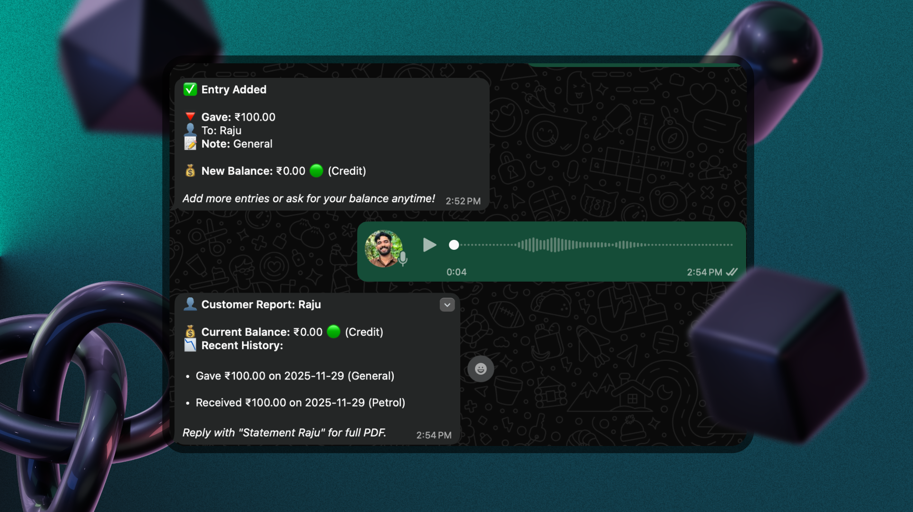

<div align="center">


### Know where your salary goes. Just chat.

**Blipko is a conversational personal-budget tracker on Telegram.** Log what you spend in plain language —
by text or voice, in English, Hindi, Hinglish, Malayalam, or Manglish — and Blipko sorts it into a 50/30/20
budget, tells you what's left, and answers questions about your money. No app to install. No forms. Just a chat.

[](https://blipko.lol)
[](https://www.typescriptlang.org/)
[](https://nextjs.org/)
[](https://www.prisma.io/)
[](https://core.telegram.org/bots)
[](LICENSE)

</div>

---

## Why Blipko

Most months, the salary just… disappears. Traditional budgeting apps ask you to install something, open it,
tap through forms, and pick categories — so most people quit by week two.

Blipko removes every bit of that friction. You already have Telegram open. Type `chai 30` and it's logged,
categorized, and counted against your budget in under a second. The discipline of budgeting, with the effort
of texting a friend.

---

## How it works

```
You:   chai 30
Blipko: ✅ ₹30 → Wants · Food
        Wants left this cycle: ₹14,770 / ₹15,000

You:   🎤 (voice note) "auto eighty to office"
Blipko: ✅ ₹80 → Needs · Transport

You:   /status
Blipko: 📊 This cycle — Day 15 of 30
        🏠 Needs   ▓▓▓░░░░░░░  ₹12,500 / ₹25,000  (50%)
        🎯 Wants   ▓▓▓▓░░░░░░  ₹9,200 / ₹15,000   (61%)
        💰 Savings ▓░░░░░░░░░  ₹2,000 / ₹10,000   (20%)
        Safe daily spend left:  Needs ₹833/day · Wants ₹420/day

You:   can I afford a 4000 pair of shoes?
Blipko: You've got ₹5,800 left in Wants with 15 days to go, so ₹4,000 fits —
        but it leaves you ~₹120/day. Doable if you go easy on eating out.
```

---

## Features

### 💬 Conversational capture
Log a spend the way you'd say it — `chai 30`, `auto 80 office`, `petrol 500 koduthu`, `netflix 199`. The AI
reads informal, code-mixed Indian languages (English / Hindi / Hinglish / Malayalam / Manglish), extracts the
amount, picks the category, and assigns a bucket. Send a **voice note** and it's transcribed and logged too.

### 🪣 Automatic 50/30/20 budgeting
Every spend lands in **Needs (50%)**, **Wants (30%)**, or **Savings (20%)** — the proven rule, fully
adjustable. Budgets run on a **payday-aware cycle** (set your payday; day 1 = calendar month), and your
effective income is `max(expected salary, income logged this cycle)` so salaried and variable-income users
both work.

### 🧭 Guided onboarding
A short wizard, not a form: enter your take-home income → tap the spending groups you actually have (common
ones pre-ticked) → Blipko auto-creates their subcategories with **income-based budget suggestions** → choose
how hard it should nudge you. Three taps and you're tracking.

### 🗂️ Category taxonomy with per-category limits
Seven parent groups (Essentials, Food & Drinks, Transportation, Entertainment & Leisure, Health & Wellness,
Miscellaneous, Savings) break down into leaf categories (Rent, Groceries, Eating Out, Fuel…). Each leaf can
carry a **monthly limit**, editable on the web or via chat.

### 🤖 Ask anything
Beyond logging, Blipko answers free-form questions grounded in *your* real data via a tool-calling agent:

> "how much did I spend on food this month?" · "what's my biggest expense?" · "am I spending more than last month?"

### 🔔 Reminders you control
Proactive nudges before you blow a bucket — but **opt-in by intensity**, default off:

| Dosage | What you get |
|---|---|
| **Off** | Nothing (default) |
| **Gentle** | 80% and over-budget warnings, once per cycle |
| **Aggressive** | + a 50% heads-up and a daily check-in |
| **Relentless** | Daily check-in and repeated over-budget alerts |

### 🔁 Recurring income & expenses
`rent 8000 on 1st every month` sets up a rule that auto-posts each cycle. Salary, subscriptions, EMIs — set
once, tracked forever.

### 📊 Web dashboard
Sign in with Google at **[blipko.lol](https://blipko.lol)** for the full picture: animated overview KPIs,
income-vs-spending and per-bucket trends, category breakdowns, a filterable transaction list (expenses +
income tabs, CSV export), category & per-category-limit editing, recurring management, and all your settings.

---

## Commands

| Command | What it does |
|---|---|
| `/start` | Set up (or redo) your budget — runs the onboarding wizard |
| `/status` | Budget health this cycle + safe daily spend |
| `/report` | This cycle's summary and your biggest leaks |
| `/recurring` | Manage repeating income/expenses |
| `/settings` | Change your reminder intensity |
| `/help` | Full guide to everything the bot can do |
| `undo` | Remove your last entry |
| *(just ask)* | "how much on groceries?", "can I afford X?", "biggest expense?" |

---

## Screenshots

<div align="center">




</div>

---

## Tech stack

| Layer | Tech |
|---|---|
| Backend | Node.js + Express, TypeScript (strict, Clean Architecture) |
| Database | PostgreSQL via Prisma (hosted on Railway) |
| AI parsing | OpenAI `gpt-4o-mini` (primary) → Gemini 2.0 Flash (fallback), structured output |
| Q&A agent | OpenAI function-calling over read-only data tools |
| Voice | Sarvam AI transcription |
| Messaging | Telegram Bot API (webhook) |
| Scheduler | node-cron (recurring auto-post, nudges, pruning) |
| Web | Next.js 16 (App Router) + React 19, NextAuth v5 (Google), Server Actions |
| Tests | Vitest (unit) + Playwright (API/E2E) |

---

## Architecture

Two runtimes share one `prisma/schema.prisma`. The backend follows Clean Architecture; the web app talks to
the DB directly through Server Actions (no REST layer between them).

```
blipko/                  ← Backend: Express + Prisma (TypeScript, CommonJS)
  src/
    domain/              ← Entities, repository & service interfaces (no outer imports)
    application/         ← Use cases + message processors (the business logic)
    data/                ← Prisma repositories, AI parsers, Telegram + Sarvam services
    presentation/        ← Express routes + Telegram webhook controller
  prisma/                ← Shared schema, migrations, seed
└── web/                 ← Frontend: Next.js dashboard (Server Actions)
```

**Message flow**

```
Telegram → TelegramWebhookController → ProcessIncomingMessageUseCase
  1. ensureUserExists (+ link Telegram ↔ web account)
  2. load recent conversation history
  3. pre-parse processors (no AI): onboarding wizard, button callbacks, /status, /report,
     /settings, /help, undo
  4. AI parse → ParsedData { intent, amount, category, bucket, confidence, … }
  5. intent processor handles it: Expense · Income · Recurring · Query (ask-anything) · Fallback
```

Low-confidence parses ask you to confirm the bucket with inline buttons; every Telegram message ID is recorded
so duplicate deliveries are dropped.

---

## Local development

### Prerequisites
- Node.js 20+ and **pnpm**
- A PostgreSQL database URL
- Telegram bot token (from [@BotFather](https://t.me/BotFather))
- OpenAI and Gemini API keys (Sarvam key for voice notes, optional)

### 1 · Install
```bash
git clone https://github.com/square-story/blipko.git
cd blipko
pnpm install
```

### 2 · Configure
```bash
cp .env.example .env
# DATABASE_URL, OPENAI_API_KEY, GEMINI_API_KEY,
# TELEGRAM_BOT_TOKEN, TELEGRAM_WEBHOOK_SECRET, SARVAM_API_KEY, PORT
```

### 3 · Database
```bash
pnpm prisma:migrate     # apply migrations
pnpm prisma:generate    # generate the client
pnpm db:seed            # seed the system category taxonomy
```

### 4 · Run
```bash
pnpm dev                # backend (ts-node-dev) on $PORT
cd web && pnpm dev      # dashboard on :3000
```

### 5 · Point Telegram at your local bot
```bash
ngrok http <PORT>
WEBHOOK_URL=https://<your-ngrok>.ngrok.app pnpm webhook:set
# registers https://<ngrok>/api/webhooks/telegram with your secret token
```

The dashboard needs its own env — copy `web/.env.example` → `web/.env.local` and fill in `AUTH_SECRET`,
`AUTH_GOOGLE_ID`, `AUTH_GOOGLE_SECRET`, and `DATABASE_URL`.

---

## Testing

```bash
pnpm test:unit          # Vitest unit tests (processors, budget math, agents)
pnpm test               # Playwright API/E2E suite (auto-starts the server)
pnpm lint               # ESLint
```

---

## Deployment

Deployed on **Railway** as two services (backend + Next.js web) plus a managed PostgreSQL instance, all on one
schema. The backend's pre-deploy step runs `prisma migrate deploy`; the web build syncs the shared schema
before generating its Prisma client. Live at **[blipko.lol](https://blipko.lol)**.

---

## Roadmap

- **Weekly habit tracking** — weekly budgets and urgency nudges for high-frequency habits (coffee, eating out)
  to break the "small daily dose" spend pattern.

---

## License & author

MIT — see [LICENSE](LICENSE). Built by **[Mohammed Sadik](https://sadik.is-a.dev)**.
